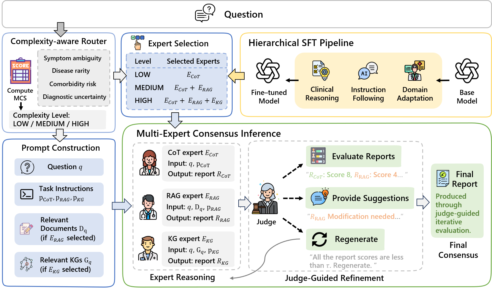

# CAMEC: Complexity-Aware Multi-Expert Collaboration for Chinese Medical QA

CAMEC is a **research-oriented Chinese medical large language model (LLM) system**
that integrates **hierarchical medical fine-tuning**, **complexity-aware expert routing**,
and **multi-expert collaboration** to improve reliability in complex medical question answering.

This repository provides a **system-level implementation** of the framework proposed in:

> **CAMEC: Complexity-Aware Multi-Expert Collaboration for Reliable Chinese Medical Question Answering**  
> (ACL2026 Main Conference)

## Overview

Large language models have shown strong potential in medical question answering (QA),
but remain unreliable in **clinically complex Chinese medical scenarios** due to
hallucinations, weak factual grounding, and insufficient multi-perspective validation.

CAMEC addresses these challenges by introducing:

- **Hierarchical medical adaptation** via multi-stage LoRA-based supervised fine-tuning
- **Complexity-aware routing** to adaptively activate specialized experts
- **Parallel multi-expert reasoning** combining internal reasoning, retrieval, and structured knowledge
- **Judge-guided iterative refinement** for quality control and consensus synthesis

Rather than relying on a single reasoning path, CAMEC coordinates
**Chain-of-Thought (CoT)**, **Retrieval-Augmented Generation (RAG)**,
and **Knowledge Graph (KG)** experts under a unified **LLM-as-a-Judge**
mechanism to produce medically correct, consistent, and interpretable outputs.

## Framework Overview

<p align="center">
  
</p>

<p align="center">
  <em>Overview of the CAMEC framework.</em>
</p>

## System Architecture

CAMEC consists of four core components:

### 1. Hierarchical Medical Fine-Tuning (Training)

The base model (**Qwen3-8B**) is adapted through a **three-stage LoRA-based SFT pipeline**:

- **Domain Adaptation**  
  Aligns the model with Chinese medical terminology and clinical language.

- **Instruction Following**  
  Improves multi-turn medical consultation and instruction adherence.

- **Clinical Reasoning**  
  Enhances diagnostic reasoning with chain-of-thought supervision on complex cases.

LoRA is applied with the base model frozen to reduce training cost and improve efficiency.

### 2. Complexity-Aware Expert Router

Medical queries vary widely in diagnostic difficulty.
Invoking all experts for every query is costly and unnecessary.

CAMEC introduces a lightweight **complexity-aware router** that predicts a
**Medical Complexity Score (MCS)** based on:

- Symptom ambiguity  
- Disease rarity  
- Comorbidity risk  
- Diagnostic uncertainty  

Queries are classified into three levels:

- **LOW** → CoT expert only  
- **MEDIUM** → CoT + RAG  
- **HIGH** → CoT + RAG + KG  

This adaptive routing strategy reduces inference cost while preserving accuracy.

### 3. Multi-Expert Parallel Inference

For each query, activated experts generate structured reports **in parallel**:

- **CoT Expert (ECoT)**  
  Performs internal chain-of-thought reasoning based on clinical patterns.

- **RAG Expert (ERAG)**  
  Retrieves relevant medical QA evidence from a dense vector database  
  (Milvus + Qwen embedding) to improve factual grounding.

- **KG Expert (EKG)**  
  Conducts structured reasoning over a medical knowledge graph  
  (disease–symptom–treatment relations) to enforce consistency and safety.

Each expert focuses on a complementary aspect of medical reasoning.

### 4. Judge-Guided Iterative Evaluation

Expert reports may differ or conflict.
CAMEC employs a unified **LLM-as-a-Judge** to ensure reliability:

- Scores each expert report on:
  - Medical correctness
  - Completeness
  - Safety
- Provides targeted feedback when quality thresholds are unmet
- Triggers iterative refinement (up to a fixed number of rounds)
- Synthesizes a weighted consensus answer from high-confidence experts

This mechanism acts as an explicit quality-control layer for high-stakes medical QA.

## Repository Structure
```
.
├── finetune/
│   ├── sft_train.sh          # Three-stage LoRA-based SFT
│   ├── lora_export.sh        # Export LoRA adapters
│   └── dataset/              # Medical SFT datasets
│
├── rag/
│   ├── import.py              # Import medical QA data into Milvus
│   ├── medical_qa.jsonl       # Example medical QA corpus
│   └── medical_qa.py          # RAG-based medical QA pipeline
│
├── judge/
│   └── judge.py               # Judge-guided evaluation logic
│
├── router/
│   └── router.py              # Complexity-aware routing model
│
├── requirements.txt
└── README.md
```
